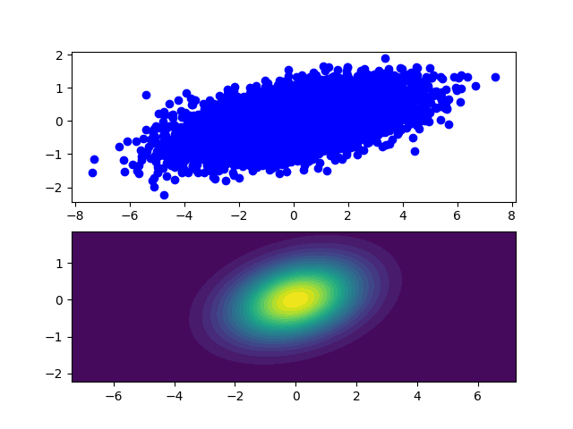

## Monte Carlo Sampling

408410086 常博愛
# Discussion
- general rejected 跟 MCMC 比較:
    - general rejected:
      -  由於每一次都是獨立重新取樣，所以比較慢。
    - MCMC:
      - using Metropolis–Hasting Algorithm
      - 取樣結果是依據上次的結果，使用markov chain stationary distribution ($\sim\text{Target distribution}$) 來取樣
      - 缺點: burn-in stage(markov chain 達到stationary distribution 所要花的iteration)
        - 不過實做上使用fixed number(my experiemnt: 1000)，所以在下面的實驗數據中顯示，可以在大量取樣時忽略不計
  
  實驗數據:
   accept rate : $\frac{\text{accept samples}}{\text{total samples}}$
   
    **accept sample = #sample

    **target function : $Beta(8,2)$ 
    |#samples|method|passing time (sec)|accpet rate|
    |-|-|-|-|
    |5000|reject|8.21|0.28|
    |5000|MCMC|8.1|__0.38__|
    |10000|reject|14.24|0.28|
    |10000|MCMC|__11.36__|__0.38__|
    |20000|reject|21.47|0.28|
    |20000|MCMC|__17.15__|__0.38__|
    |50000|reject|42.22|0.28|
    |50000|MCMC|__31.95__|__0.38__|
  
  可以看到MCMC比general reject sampling 還快。

- Gibbs sampling:
  - 是高維資料的MCMC採樣方法。
    - 是依照conditional probability 來取樣:
      - $x_{i}^{t+1}=p(x|x_{0}^{t+1},x_{1}^{t+1},...,x_{i-1}^{t+1}, x_{i+1}^{t},...)$
    - 優點由於不用reject，所以速度快
    - 缺點則是要知道相對於target distribution 的conditional probability

    - 實驗: 
      - target distribution:
        - 2D Gaussian distribution: 
  
      $\begin{bmatrix}
      x_0 \\ x_1
      \end{bmatrix}\sim N(\mu=\begin{bmatrix} 0\\0 \end{bmatrix},\sigma =\begin{bmatrix}2.0 & 0.3\\ 0.3 & 0.5\end{bmatrix})$. 

      - conditional probability:
        - $p(x_0|x_1)\sim N(\mu _0+\frac{\sigma _{01}}{\sigma _{11}}(x_1-\mu _1), \sigma _{00}-\frac{\sigma _{01}^2}{\sigma _{11}})$
        
          $p(x_1|x_0)\sim N(\mu _1+\frac{\sigma _{01}}{\sigma _{00}}(x_0-\mu _0), \sigma _{11}-\frac{\sigma _{01}^2}{\sigma _{00}})$

      in this case: $\sigma _{\text{condition}= (1.82, 0.455)}$
    
    reference: https://mr-easy.github.io/2020-05-21-implementing-gibbs-sampling-in-python/

    採樣1000個點的時間: 0.21 sec

# data visualization
$x\sim Beta(8,2) \in (0,1]$ : 
- general rejected sampling:
  
  - 
  
- MCMC:
  
   - 

  
$x\sim \text{DoubleGmma}(\alpha=1) \in (0,1]$:

- general rejected sampling:
  
  - 
  
- MCMC:
  
   - 

Gibbs sampling:

$\begin{bmatrix}
      x_0 \\ x_1
      \end{bmatrix}\sim N(\mu=\begin{bmatrix} 0\\0 \end{bmatrix},\sigma =\begin{bmatrix}2.0 & 0.3\\ 0.3 & 0.5\end{bmatrix})$
  - 